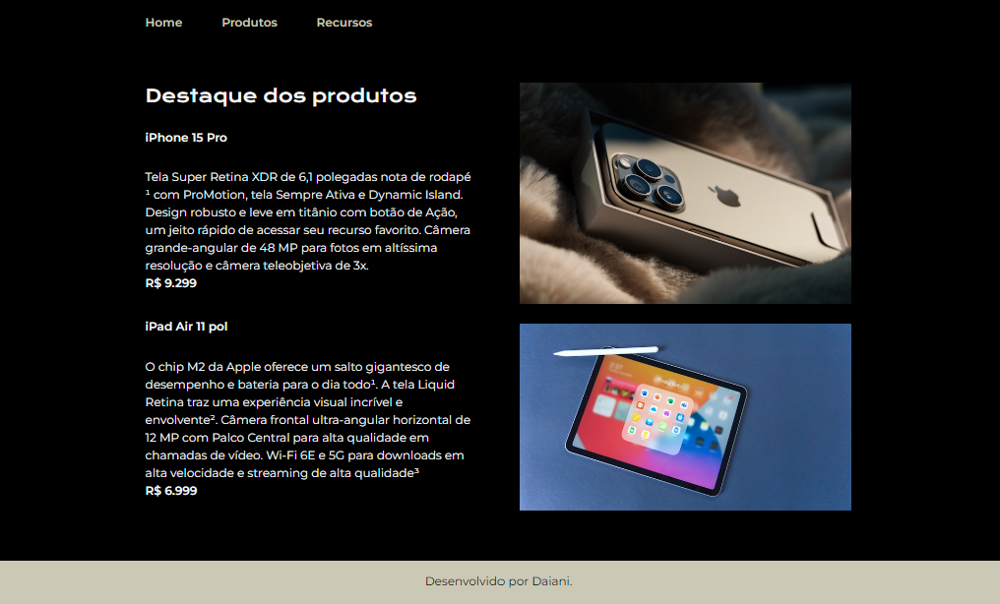

## 🖥️ Projeto
Este é um projeto web responsivo desenvolvido na disciplina de "Desenvolvimento Front-End". A da proposta inicial do projeto é ele deveria conter um cabeçalho, e um menu navegação com uma página "Destaque do Produto" e outra "Recurso", adicionei uma terceira página chamada "Home" para conter informações adicionais. 

Os requisitos do projeto envolviam a utilização de diversos recursos do HTML5 e CSS3, dentre eles um layout responsivo, listas, grid, adição de ícones, imagens e uso de Flexbox. 

## 🚀 Tecnologias 
- HTML5
- CSS3
- BootStrap
- Git e Github